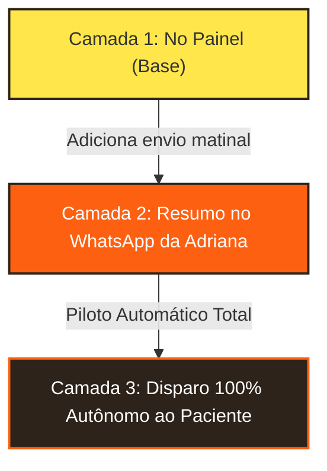

# 🤖 Guia Definitivo: Assistente com IA e Automação 100% Gratuita para a Dra. Adriana

Este guia esclarece:
1. Como enviar o **resumo matinal diretamente para o WhatsApp pessoal da Dra. Adriana** (sem precisar de Telegram).
2. Como as soluções funcionam: **elas são partes complementares de um mesmo ecossistema integrado**.

---

## 🧩 As 3 Opções São Diferentes ou se Completam?

**Elas se completam perfeitamente!** Pense nelas como **3 camadas de evolução** de um mesmo ecossistema. Você pode começar pela mais simples hoje e ir subindo de nível conforme a Dra. Adriana desejar mais conforto e automação:



### 🟡 Camada 1: Central de Lembretes no Painel (O Coração da Agenda)
- **O que faz:** Ao abrir o site na aba `/agenda`, a psicóloga vê o banner de lembretes e a Assistente IA.
- **Como funciona:** Clica em **`✨ Central de Lembretes`** ou pede por voz à IA (*"Avisar pacientes de amanhã"*). O sistema lista todos e ela clica em **Enviar WhatsApp** para cada um.
- **Vantagem:** Não precisa de nenhuma configuração externa! Já está pronta, testada e funcionando no site agora mesmo.

---

### 🟠 Camada 2: Resumo Matinal no WhatsApp da Adriana (Google Apps Script + CallMeBot)
- **O que faz:** Em vez de a Adriana precisar lembrar de entrar no site todo dia de manhã, o próprio **Google Agenda** dela faz isso!
- **Como funciona:**
  - Como o site já sincroniza todas as consultas no Google Agenda dela, às **08h00 da manhã** um robô gratuito da Google (`google-apps-script/autoReminder.js`) consulta a agenda do dia seguinte.
  - Ele envia uma mensagem no **WhatsApp pessoal da Dra. Adriana** com a lista do dia:
    ```text
    ☀️ Bom dia, Dra. Adriana!
    Você tem 3 atendimentos agendados para amanhã:

    1. 09:00 - Camila Silveira (Presencial)
    👉 Enviar confirmação: https://wa.me/5519999991111?text=Ola+Camila...

    2. 14:00 - Marcos Souza (Online)
    👉 Enviar confirmação: https://wa.me/5519999992222?text=Ola+Marcos...

    3. 16:00 - Beatriz Lima (Presencial)
    👉 Enviar confirmação: https://wa.me/5519999993333?text=Ola+Beatriz...
    ```
  - A Dra. Adriana só precisa abrir o WhatsApp dela na cama ou tomando café, tocar no link de cada paciente e a mensagem de confirmação abre no WhatsApp pronta para enviar!

---

### ⚫ Camada 3: Piloto Automático Total (Evolution API)
- **O que faz:** O paciente recebe a mensagem no WhatsApp dele sem a Dra. Adriana precisar clicar em nada.
- **Como funciona:** Conecta um gateway gratuito de código aberto (Evolution API). Às 08h da manhã, o robô dispara direto para o número do paciente.
- **Quando usar:** Quando a Dra. Adriana disser: *"Não quero ter que clicar em nenhum link, quero que envie 100% sozinho!"*.

---

## 📲 Passo a Passo: Como Ativar o Resumo no WhatsApp da Adriana (Camada 2) em 3 Minutos

Usaremos o **CallMeBot**, um serviço 100% gratuito feito especialmente para enviar notificações para o seu próprio WhatsApp:

### Passo 1: Pegar a chave gratuita no WhatsApp da Adriana (30 segundos)
1. No WhatsApp da Dra. Adriana (ou no seu para testar), adicione o número do CallMeBot:
   - **`+34 644 44 20 89`** (ou `+34 644 10 55 84`)
2. Envie exatamente esta mensagem em inglês para ele:
   ```text
   I allow callmebot to send me messages
   ```
3. Em alguns segundos, o robô responderá com uma mensagem contendo:
   - *Your APIKey is: 1234567*

---

### Passo 2: Colocar o Robô para Rodar no Google Apps Script (2 minutos)
1. Acesse [script.google.com](https://script.google.com/home) logado no Gmail da Adriana (ou no seu para testar).
2. Clique no botão azul **"+ Novo projeto"** no canto superior esquerdo.
3. Dê o nome de **"Robô de Lembretes Dra. Adriana"**.
4. Apague qualquer código que estiver na tela e cole o código completo do arquivo [`google-apps-script/autoReminder.js`](file:///c:/Projetos/site-drica/google-apps-script/autoReminder.js).
5. No início do código, preencha apenas duas linhas no bloco `CONFIG`:
   ```javascript
   WHATSAPP_ADRIANA_NUMERO: "5519999999999", // Número do WhatsApp com 55 e DDD
   CALLMEBOT_API_KEY: "1234567",             // A APIKey que você recebeu no WhatsApp
   ```
6. Clique no ícone de disquete (**Salvar**).
7. Para agendar o envio todos os dias às 08h:
   - No menu lateral esquerdo, clique no ícone de relógio (**Acionadores**).
   - Clique em **"+ Adicionar acionador"** no canto inferior direito.
   - Escolha a função: `executarRotinaLembretesDiarios`.
   - Origem do evento: **Baseado no tempo**.
   - Tipo de acionador: **Temporizador por dia**.
   - Hora do dia: **Entre 8h e 9h da manhã**.
   - Clique em **Salvar** e aprove as permissões do Google.

Pronto! A partir de agora, **todas as manhãs a Dra. Adriana recebe o resumo das consultas do dia seguinte no WhatsApp dela com os links de 1 toque para confirmar com os pacientes.**
